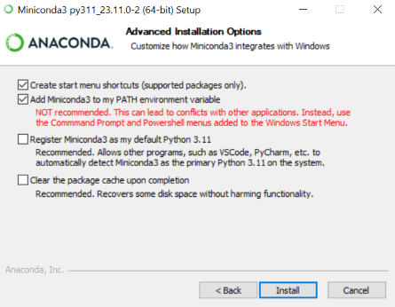
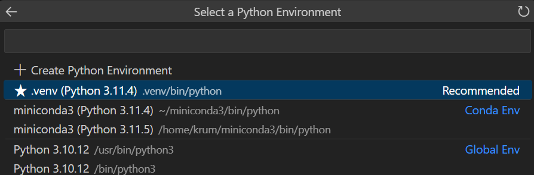

OSN ADS-B Setup
==============
<br/>

# 1. Setup of Miniconda
In a first step it is necessary to get a recent Python installation on your computer. For this purpose, the use of Miniconda is recommended, the latest version of which can be downloaded from this [Website](https://docs.conda.io/projects/miniconda/en/latest/). Miniconda is a slimmed down version of Anaconda with a minimum of pre-installed packages. Only the packages you really need can be installed later, keeping size the installation small.

Run the downloaded .exe file which will guide you through the installation.

><span style="color:red">IMPORTANT:</span> On the "Advanced Installation Options" page of the installation process, be sure to check "Add Anaconda to my PATH environment variable", even though it is not recommended: 
>
>

<br/>

# 2. Setup of VSCode
The next step is to download and install a programming environment. While it is possible to use any programming environment that supports Python, it is highly recommended to use VSCode, which can be downloaded from this 
[website](https://code.visualstudio.com/Download). Once again, run the downloaded .exe file and follow the installation, this time keeping all the default settings.

<br/>

# 3. Setup of Poetry
To manage environments and their packages, it is recommended to use Poetry instead of the basic Conda. To install Poetry, open any terminal (e.g. in VSCode) and run the following command:

```bash
conda install -c conda-forge poetry
```

This will install Poetry into your base Python environment. In order to get Poetry to create virtual environments directly within the project, this needs to be configured. To do this, also run the following line in a terminal

```bash
poetry config virtualenvs.in-project true
```

With these two steps, poetry is set up and can be used to create an environment for your project. To do this, make sure you are inside your project folder in a terminal and then run the following command:

```bash
poetry init
```

Poetry will now interactively guide you through the setup of an environment, allowing you to add the necessary packages. To start working with ADS-B data it is recommended that you install the following packages in your environment:

1. traffic
2. plotly
3. nbformat (>=4.2.0)

Once you have completed the guided process, you will find a new file called pyproject.toml in your project folder, which contains information about the environment you have just defined. To build a virtual environment based on this file, run the following line in your terminal:

```bash
poetry install
```

This will create an additional "poetry.lock" file in your project folder, along with a folder named .venv. In any Jupyter notebook, you can now select the virtual environment you have just created by clicking on the kernel selector in the top right corner and selecting _Python Environments -> .venv_:



It is also always possible to add additional packages to the envrionment at a later date. To do this, simply execute the following command in a terminal:

```bash
poetry add package_name
```

<br/>

# 4. Setting OSN Credentials
In order to retrieve data from the OpenSky network using the Traffic library, it is necessary to provide Traffic with your access credentials. This is done by entering them in a config file of the library. To locate this config file on your computer, open any jupyter notebook and type the following two lines, then run them:
```python
import traffic
traffic.config_file
```
This should give you the path to the traffic.conf file. Open this file with any text editor and locate the part that looks like the following.

```
[opensky]
username =
password =
```
Enter the username and password provided by the ZAV and save the edited file.

---
When you have completed all these steps, you should be ready to start working with ADS-B data. For some tutorials on how to get started, navigate to the [traffic](../traffic/) folder.